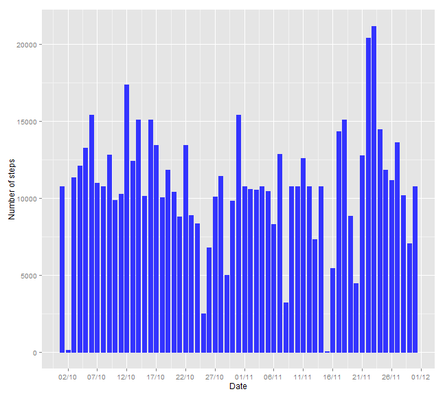

Reprocuible Research - Project Assignment 1
========================================================

## Loading and preprocessing the data


```r
#Create the directory and download the files

directory.file <- "D:/Documents/2A/R courses John Hopkins University/Reproducible Research/Project"

if (!file.exists(directory.file)){
  dir.create(directory.file)  
}

setwd(directory.file)

fileUrl <- "https://d396qusza40orc.cloudfront.net/repdata%2Fdata%2Factivity.zip"

if (!file.exists("./donnee.zip")){
  download.file(fileUrl,destfile="./donnee.zip")
  unzip("./donnee.zip", exdir = ".")
}

file <- list.files()[grepl(".csv",list.files(),ignore.case=TRUE)]
activity <- read.csv(file)

#Change the class of the variable date into a class Date
activity$date <- as.Date(activity$date)
```

## What is mean total number of steps taken per day?


```r
#Histogram of the total number of steps taken each day
library(ggplot2);library(scales)
#Compute the total steps taken for each day
totalstepsperday <- aggregate(activity$steps,by=list(date=activity$date),function(x) sum(x,na.rm=TRUE))
colnames(totalstepsperday)[2] <- "steps"
totalstepsperday$date <- as.Date(totalstepsperday$date)
#Plot the histogram
histogram <- ggplot(totalstepsperday,aes(x=totalstepsperday$date, y=steps))
histogram <- histogram + geom_histogram(stat="identity",position="dodge",width=.7,fill="#3333FF", colour="#3333FF")
histogram <- histogram + xlab("Date") + ylab("Number of steps") 
histogram <- histogram + scale_x_date(breaks = date_breaks("5 days"),labels = date_format("%d/%m"))          
histogram
```


```r
#Computation of the mean and median
meanperday <- mean(totalstepsperday$steps)
medianperday <- median(totalstepsperday$steps)
```

The mean of the total number of steps per day is 9354.2295, the median is 10395.

## What is the average daily activity pattern?

```r
#Average number of steps in the 5 minutes intervals
average_steps_intervals <- aggregate(activity$steps,by=list(interval=activity$interval),function(x) mean(x,na.rm=TRUE)) 
colnames(average_steps_intervals)[2] <- "steps"
timeserie <- qplot(x=interval, y=steps,data=average_steps_intervals,geom="line")
timeserie
```


```r
#5-minute interval, on average across all the days in the dataset, which contains the maximum number of steps
max_interval <- average_steps_intervals$interval[which(average_steps_intervals$steps==max(average_steps_intervals$steps))]
```
The 5-minute interval that contains the maximum number of steps is 835.

## Imputing missing values


```r
#Total number of missing values in the dataset
nb_na <- sum(is.na(activity$steps))
```
The total number of missing value in the data set is 2304.

The Nas are filled with the mean of the steps for the corresponding 5-minutes period:

```r
#prediction of na values
complete_activity <- activity
for (i in 1:288){
  inter <- average_steps_intervals$interval[i]
  value <- average_steps_intervals$steps[i]
  
  complete_activity$steps[complete_activity$interval==inter & is.na(complete_activity$steps)] <- value  
}
```
The new data is now called *complete_activity*.


```r
#Histogram, mean and median
#Compute the total steps taken for each day
c_totalstepsperday <- aggregate(complete_activity$steps,by=list(date=complete_activity$date), sum)
colnames(c_totalstepsperday)[2] <- "steps"
c_totalstepsperday$date <- as.Date(c_totalstepsperday$date)
#Plot the histogram
c_histogram <- ggplot(c_totalstepsperday,aes(x=date, y=steps))
c_histogram <- c_histogram + geom_histogram(stat="identity",position="dodge",width=.7,fill="#3333FF", colour="#3333FF")
c_histogram <- c_histogram + xlab("Date") + ylab("Number of steps") 
c_histogram <- c_histogram + scale_x_date(breaks = date_breaks("5 days"),labels = date_format("%d/%m"))          
c_histogram
```



```r
#Computation of the mean and median
c_meanperday <- mean(c_totalstepsperday$steps)
c_medianperday <- median(c_totalstepsperday$steps)
```
The mean of the total number of steps per day is 1.0766 &times; 10<sup>4</sup>, the median is 1.0766 &times; 10<sup>4</sup>.

Imputing missing data on the estimates of the total daily number of steps has no significant consequences.

## Are there differences in activity patterns between weekdays and weekends?


```r
#Patterns weekdays-weekends
complete_activity$date <- as.Date(complete_activity$date)
complete_activity <- cbind(complete_activity,
                           days=weekdays(complete_activity$date))

day_end <- rep("",nrow(complete_activity))
day_end[complete_activity$days=="samedi" | complete_activity$days=="dimanche"] <- "weekend"
day_end[complete_activity$days!="samedi" & complete_activity$days!="dimanche"] <- "weekday"
complete_activity$days <- day_end

#Average number of steps in the 5 minutes intervals
c_average_steps_intervals <- aggregate(complete_activity$steps,by=list(interval=complete_activity$interval,
                                                                       day_end=complete_activity$days),mean) 
colnames(c_average_steps_intervals)[3] <- "steps"

c_timeserie <- qplot(x=interval, y=steps,data=c_average_steps_intervals,
                     geom="line",facets=.~day_end,ylab="Number of steps")
c_timeserie
```


